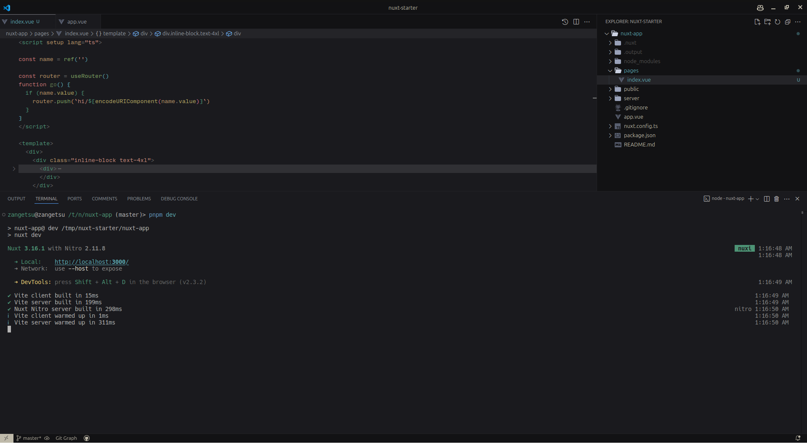

<h1 align="center">Dark Discord Theme</h1>

zangetsu002.dark-discord-theme

  <samp>
    &nbsp;&nbsp;&nbsp;&nbsp;&nbsp;&nbsp;&nbsp;Font | <a href="https://input.djr.com/">Input Mono</a> 
&nbsp;File Icons | <a href="https://marketplace.visualstudio.com/items?itemName=Yummygum.city-lights-icon-vsc">City Lights B&W</a> 

## Thanks

This project is based on [vscode-theme-vitesse](https://github.com/antfu/vscode-theme-vitesse/tree/main) and [github-vscode-theme](https://github.com/primer/github-vscode-theme).

## License

MIT - Copyright (c) 2020 Primer  
MIT - Copyright (c) 2021 Anthony Fu  
MIT - Copyright (c) 2025 Christian Palladini  
